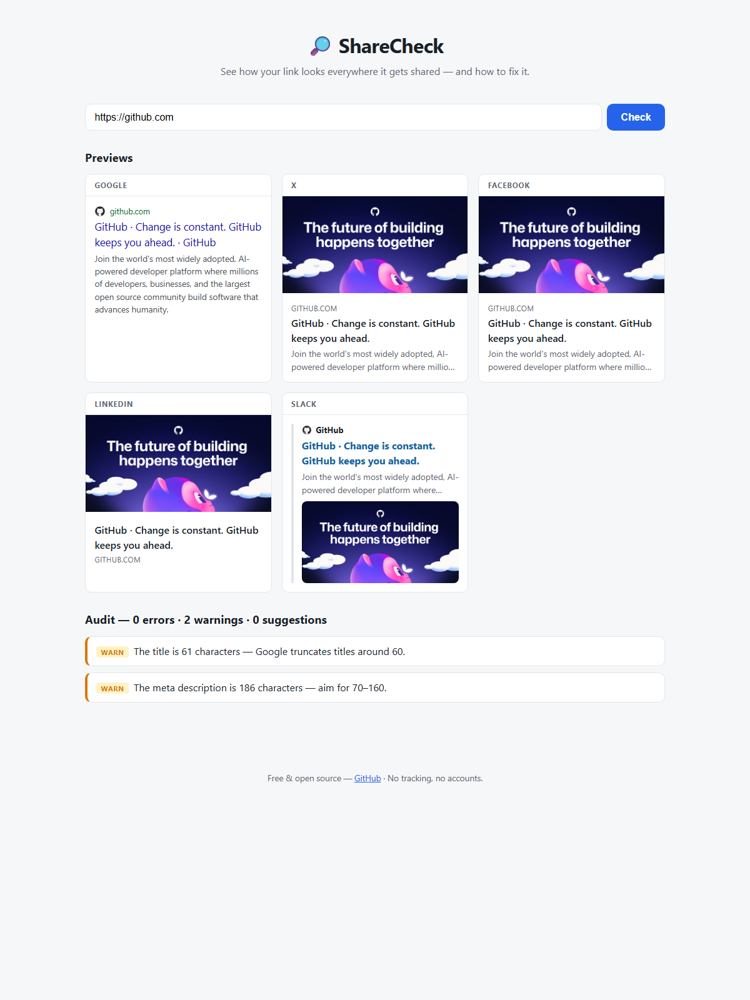

# 🔎 ShareCheck

**See how your link looks everywhere it gets shared — and how to fix it.**

[](https://github.com/OWNER/sharecheck/actions/workflows/ci.yml)

**Live demo → https://sharecheck.vercel.app**

Paste a URL and ShareCheck shows you pixel-faithful previews of how that link
renders on **Google search, X, Facebook, LinkedIn, and Slack** — then audits the
page's meta tags and hands you copy-paste fixes for everything that's missing
or broken.



## Why

Every "check your Open Graph tags" tool is either ad-stuffed, paywalled, or
shows one platform at a time. ShareCheck is free, fast, open source, and shows
all five at once — with the fix, not just the diagnosis.

## What it checks

19 rules across three severity levels, including:

- Missing or truncated `<title>` / meta description (Google limits)
- Missing `og:title`, `og:description`, `og:image`, `og:url`, `og:type`
- `og:image` problems: relative URL, non-HTTPS, fails to load, smaller than
  the 1200×630 recommendation, below the 200×200 platform minimum
- `twitter:card` missing or not `summary_large_image`
- Canonical link missing or disagreeing with `og:url`
- Missing favicon

Every finding comes with a ready-to-paste `<meta>` snippet, pre-filled with
your page's own values where possible.

## How it works

- **Static vanilla-JS frontend** — no framework, no build step
- **One serverless function** (`api/fetch.js`) fetches the target page
  server-side (browsers can't, thanks to CORS) — hardened with an SSRF guard,
  redirect re-validation, timeouts, and a body-size cap
- **Pure parser + rules modules** (`src/meta.js`, `src/rules.js`) shared
  verbatim between the browser and the Node test suite
- **Zero dependencies** — runtime and dev; tests run on Node's built-in runner

## Run it locally

```bash
git clone https://github.com/OWNER/sharecheck && cd sharecheck
npm run dev     # → http://localhost:3000  (no install step — zero dependencies)
npm test        # run the test suite
```

Tip: `/?url=https://your-site.com` auto-runs a check — results are shareable links.

## License

[MIT](LICENSE)
